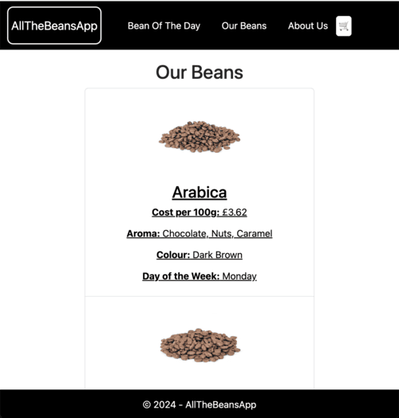
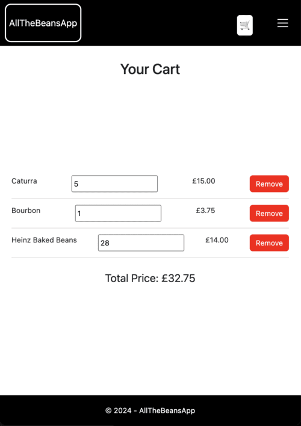

# AllTheBeansApp

## Description
AllTheBeansApp is my first web application built using C# and ASP.NET Core. It shows different types of beans and features a "Bean of the Day" section:


A list of all available beans with information about each bean:


 
A cart feature where customers can add and remove beans, this image also shows the media query layout for smaller screens:




I kept the design functional, but simple, as the specification mentioned that design skills would not be judged. 

As far as the task itself, I had a great time learning more about C# and building on my knowledge of HTML, CSS & JS within the .NET framework - it does seem to be an extremely tidy and efficient system, and it was good to practice MVC architecture.

NB - I created the project using the:
    ```
    dotnet new mvc -n AllTheBeansApp
    ``` 
    command, and as a result there are a number of default files. As it is my first time using this framework I have left some of the files I was less familiar with alone, but am actively researching their use cases.

## Requirements
- .NET SDK (version 9.0 or later)
- Newtonsoft.Json (version 13.0.3)
- Node.js and npm (for managing client-side packages)

## Installation
1. Clone the repository:
    ```bash
    git clone https://github.com/xaatu/AllTheBeansApp
    ```
2. Navigate to the project directory:
    ```bash
    cd AllTheBeansApp
    ```
3. Install the dependencies:
    ```bash
    npm install
    ```
3. (alternate) Install the dependencies:
">NuGet" in search bar
Click Add NuGet Package:
then type:
    
    Install-Package Newtonsoft.Json
    


## Project Structure
- **Controllers**: Contains the logic for handling HTTP requests (e.g., `HomeController.cs`).
- **Models**: Contains the data models and business logic (e.g., `BeansRepository.cs`, `Bean.cs`).
- **Views**: Contains the Razor views for rendering HTML (e.g., `_Layout.cshtml`, `Index.cshtml`).
- **wwwroot**: Contains static files like CSS, JavaScript, and images.

## Features
- **Bean of the Day**: Displays a featured bean based on the current day of the week.
- **All Beans**: Lists all available beans with detailed information.
- **Cart**: Contains all the beans customers have added to cart, alongside item price and total price.
- **Navigation**: Easy navigation between different sections of the app.
- **Responsive Design**: Uses Bootstrap for a responsive and modern UI.


## How to run

1. Build:
    ```bash
    dotnet build
    ```
2. Run:
    ```bash
    dotnet run
    ```


3. (optional) for Hot Reloads ((has been extremely useful while building!)):
    ```bash
    dotnet watch run
    ```


## Contact
For any inquiries or feedback, please contact [sandy.quigley95@gmail.com].